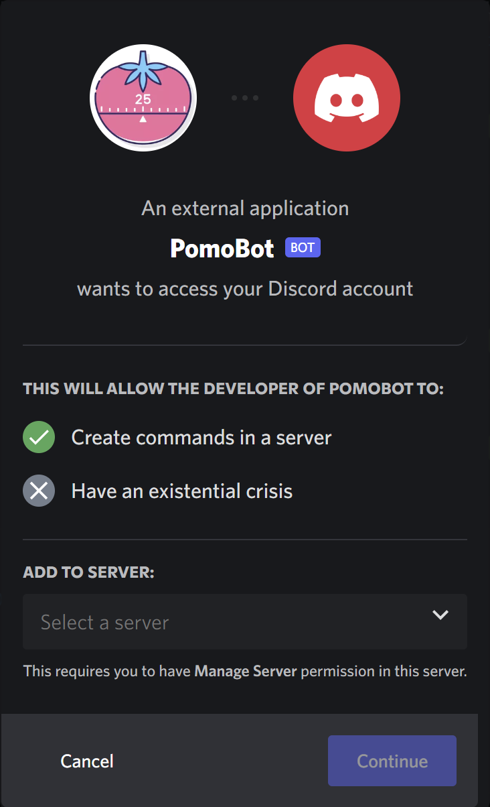
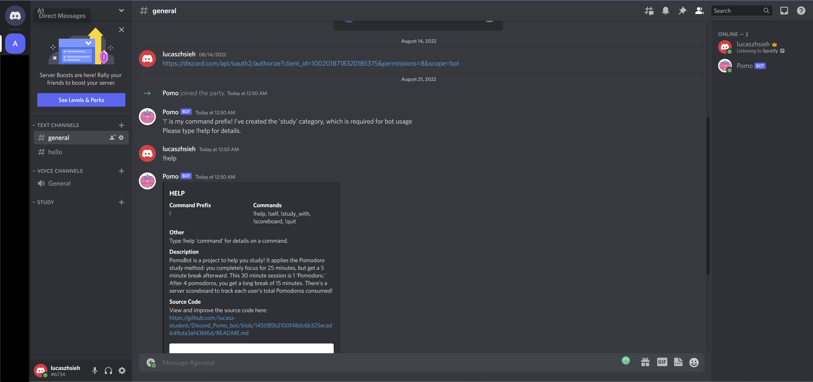

# Discord Pomodoro Bot

## Introduction 

This is one of my python projects. I created a "discord bot" that helps you use the Pomodoro study method, also keeping you accountable and productive with a server scoreboard. Discord is a messaging platform; users can make voice and and video calls, send media and files in private communites called "guilds," or "servers."
 

## Install and Details 

The server isn't constantly run on a cloud, but you can fork and change the source code. However, you have to create an application through the developer portal. Here's the link <a href="https://discord.com/api/oauth2/authorize?client_id=1002018718320185375&permissions=8&scope=bot">to add PomoBot</a> to your server.

By default, the bot adds a study category to the server, which is required for the use of most commands. The bot applies the Pomodoro study method: you completely focus for 25 minutes, but get a 5 minute break afterward. This 30 minute session is 1 'Pomodoro.' After 4 pomodoros, you get a long break of 15 minutes.

### Other 

Here's what I used to code the bot:

<a href="https://discord.com/developers/docs/intro">Discord Developer Portal</a>
<a href="https://discordpy.readthedocs.io/en/stable/api.html#guilds">Discord.py API reference</a>

Image Credit:
Pomodoro free icon designed by Flat Icons https://www.flaticon.com/premium-icon/pomodoro_3696891?term=pomodoro via @flaticon

### Contact and Closure
I want to understand everything about coding, the internet, and computer science I can learn while having fun.  
My plan is to become an internet wizard and take over the world.  
Contact me at l.hsieh.student@gmail.com 
