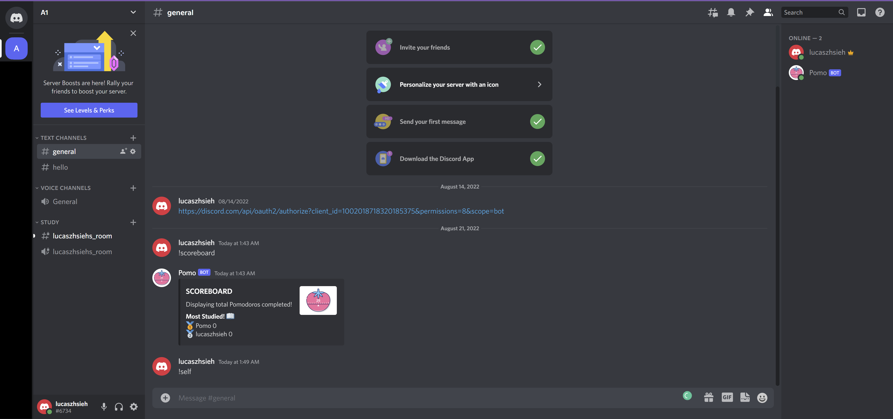

# Discord Pomodoro Bot

## Introduction 

This is one of my python projects. I created a "discord bot" that helps you use the Pomodoro study method, also keeping you accountable and productive with a server scoreboard. Discord is a messaging platform; users can make voice and and video calls, send media and files in private communites called "guilds," or "servers."
 

## Install and Details 

The server isn't constantly run on a cloud, but you can fork and change the source code to run it yourself. However, you have to create an application through the developer portal. Here's the link <a href="https://discord.com/api/oauth2/authorize?client_id=1002018718320185375&permissions=8&scope=bot">to add PomoBot</a> to your server. The bot uses a scoreboard system that works with json files. Everytime Pomobot joins a server, it creates a json file like <a href="./Guild 1.json">this one</a> to store user scores. 

By default, the bot adds a study category and Students role to the server, which is required for the use of most commands. The bot applies the Pomodoro study method: you completely focus for 25 minutes, but get a 5 minute break afterward. This 30 minute session is 1 'Pomodoro.' After 4 pomodoros, you get a long break of 15 minutes.

  
## Functions and Usage
The functions, and other details about usageinclude: 
<ul> 
  <li>!help, sending embed with details of Pomobot</li>
  <li>!help 'command', sending message with details of command</li>
  <li>!self, creating a private text and voice room for the command's author, taking the argument (pomodoro count). The author of the message, members of the study role, and server admins/owners can view the room.</li>
  <li>!study_with, creating a private text and voice room for the command's author and another user, taking the arguments (user_nick/user_display_name, pomodoro count). The author of the message along with the targeted yser, members of the study role, and server admins/owners can view the room.</li>
  <li>!quit, quiting a study session/channel under the study category, deleting both text and voice channels</li>
  <li>There is a 150 second cooldown for each user dedicated to the !self and !study_with command to prevent spam</li>
  <li>Administrators and owners can view and join private channels, but the default role cannot.</li>
</ul> 
  
The bot's functions have error handling, but it's far from being the perfect code. There are also many other function ideas and edits that can be made, but it would be purely for the bot. For my personal reasons, I've felt that I have already learned enough from coding this program!

### Other 
Here's what I used to code the bot:
  
<a href="https://discord.com/developers/docs/intro">Discord Developer Portal</a>
  
<a href="https://discordpy.readthedocs.io/en/stable/api.html#guilds">Discord.py API reference</a>
  
Image Credit:
Pomodoro free icon designed by Flat Icons https://www.flaticon.com/premium-icon/pomodoro_3696891?term=pomodoro via @flaticon

### Contact and Closure
I want to understand everything about coding, the internet, and computer science I can learn while having fun.  
My plan is to become an internet wizard and take over the world.  
Contact me at l.hsieh.student@gmail.com 
